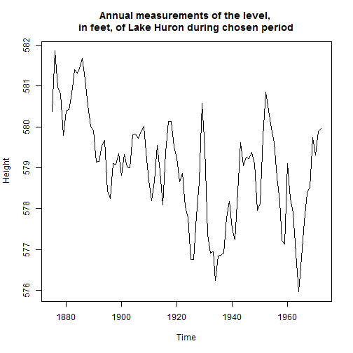

## Introduction


 - The goal of this app is to calculate the average height of Lake Huron during different time periods.
 
 - The app consists of two sections: Input and Output
 
 - The input section contains the input fields for the start and the end date
 
 - The output section contains the resulting plot of Lake Huron's height over this period

--- 

## Input section

  On the left site the different start and end date of the period can be chosen. As default for the start data
  is the first year of the data set used. As default value for end date is the last year of the data set chosen.
  
  The following picture shows the section containing the numeric input fields:
  

--- 

## Output Section
On the right site the plot shows the development of the height during the chosen period. 
Here's the code to create the plot:

```r
data(LakeHuron)
plot(LakeHuron, main = "Annual measurements of the level, 
in feet, of Lake Huron during chosen period", xlab = "Time", ylab = "Height")
```



--- 

## Example

Here's an example for the period from 1875 to 1900


